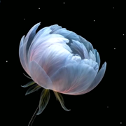

# Saransh Ahuja

I build products end to end, from ML research to consumer apps. Currently building [Zippex](https://www.zippex.app), seamless delivery for Facebook Marketplace.

More at [saranshahuja.com](https://www.saranshahuja.com).

### Now

-  **[Zippex](https://www.zippex.app)** · Uber Eats for Facebook Marketplace
-  **[Mneme](https://www.trymneme.com)** · The brain for your AI
-  **[Amie](https://www.monamie.ca)** · Your friend in your texts
-  **[Orvia](https://www.orvia.ca)** · Digital experiences, considered down to the last detail

### Selected work

-  **[Blorp](https://goblorp.com)** · SMS that scales with you
- **[Saar-GPT](https://github.com/saranshahuja/Saar-GPT)** · A GPT-2 scale language model (124M parameters) built from scratch
- **[Speech Emotion Recognition](https://github.com/saranshahuja/SER)** · Emotion-aware AI for speech analysis

### Research

Fine-grained speech emotion recognition for companion robots, published at [IEEE CAI 2023](https://ieeexplore.ieee.org/document/10195078).

### Elsewhere

[saranshahuja.com](https://www.saranshahuja.com) ·  [LinkedIn](https://www.linkedin.com/in/saranshahuja17/) ·  [X](https://twitter.com/saransh_ahuja17)
